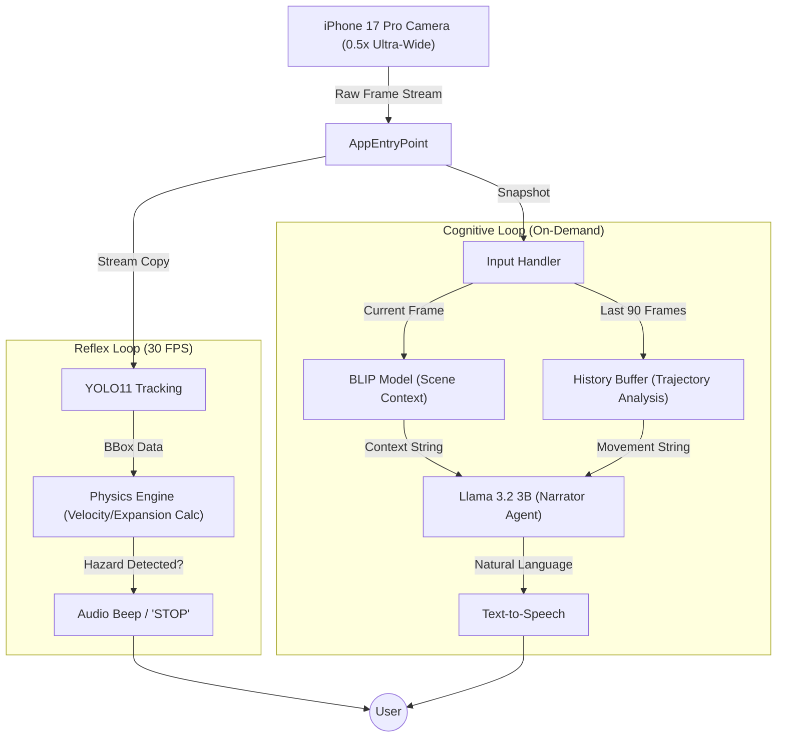

# Describe My Environment: Project Master Plan (v2.0)

**Course:** STATS 507  
**Focus:** Full-Stack ML Engineering / Edge Computing  
**Target Hardware:** Apple Silicon (M4 Pro) & iPhone 17 Pro (Ultra-Wide)

---

## 1. 🎯 Core Mission

To build a **wearable-simulated AI assistant** for visually impaired users that creates a comprehensive understanding of the physical world. Unlike traditional tools that simply list objects ("Person, Chair"), this system provides **spatial and temporal context** ("A person is walking towards you from the left").

### The "Dual-Loop" Philosophy

The human brain processes vision in two modes: **Reflexes** (fast, survival-based) and **Cognition** (slow, detail-based). This project mimics that biology:

1.  **The Reflex Loop (Safety):** Runs at 30 FPS. Instantly warns of physical collision risks.
2.  **The Cognitive Loop (Narrator):** Runs On-Demand. Synthesizes history and vision into natural language stories.

---

## 2. 🏗️ Architectural Blueprint

### High-Level Data Flow



---

## 3. 🛠️ The Tech Stack (v2.0)

We have upgraded the stack to leverage the M4 Pro's neural engine and the iPhone's advanced optics.

| Component         | Technology             | Role               | Reason for Choice                                                              |
| :---------------- | :--------------------- | :----------------- | :----------------------------------------------------------------------------- |
| **Input**         | **iPhone 17 Pro**      | Vision Sensor      | The **48MP Ultra-Wide (0.5x)** lens eliminates blind spots crucial for safety. |
| **Tracking**      | **YOLO11n-track**      | Object Persistence | Tracks unique IDs to calculate trajectory (Velocity & Direction).              |
| **Vision**        | **BLIP**               | Scene Captioning   | Provides the "Gist" of the scene (e.g., "A messy bedroom").                    |
| **Reasoning**     | **Llama 3.2 (3B)**     | Data Fusion        | Converts raw JSON data into human-like, helpful narration.                     |
| **Inference**     | **Ollama (Metal)**     | LLM Runner         | Optimized for Mac M4 GPU/NPU; runs locally with zero latency penalty.          |
| **Orchestration** | **Python (Threading)** | Controller         | Manages the async relationship between the fast and slow loops.                |

---

## 4. ✅ Concrete Functionalities

### Feature 1: The Proximity Warning (Safety)

- **Status:** _Always Active (Background)_
- **Trigger:** Automatic.
- **Logic:**
  1.  **Zone Check:** Is the object in the center 40% of the frame?
  2.  **Expansion Check:** Did the bounding box width increase by >10% in the last 0.5 seconds? (Visual Looping effect).
  3.  **Class Check:** Is it a vehicle, bike, or running person?
- **Output:** Immediate high-priority audio interrupt (Beep or "STOP").
- **Latency Target:** < 50ms.

### Feature 2: The "Narrator" (Context)

- **Status:** _On-Demand_
- **Trigger:** User presses `SPACE` or Voice Command.
- **Logic:**
  1.  **Snapshot:** Freezes current state.
  2.  **Trajectory Analysis:** specific logic determines if objects are "Approaching", "Leaving", or "Passing By".
  3.  **Fusion:** Sends `[Scene Description]` + `[Object Movements]` to Llama 3.2.
- **Output:** "You are standing on a sidewalk. A car is waiting at the light, and two people are walking past you on the right."
- **Latency Target:** ~1.5 - 2.0 seconds.

### Feature 3: Semantic Search (Find Object)

- **Status:** _Mode Switch_
- **Trigger:** "Find my keys."
- **Logic:**
  1.  Lowers detection threshold for the specific class (`keys`).
  2.  Scans frame.
- **Output:** Spatial guidance: "Keys detected, 10 o'clock, about 1 meter away."

---

## 5. 💾 Data Structures (The Contract)

To ensure modularity, our components communicate via these strict data definitions.

### 1. The Tracked Object (Internal)

Stored in the **90-frame History Buffer**.

```python
@dataclass
class DetectionPoint:
    frame_id: int
    timestamp: float
    box: Tuple[int, int, int, int]  # x1, y1, x2, y2
    area: int                        # w * h (used for depth estimation)
    center: Tuple[int, int]          # Center coordinates
```

### 2. The Prompt Payload (LLM Input)

This is the exact JSON-like structure we generate for Llama 3.2.

```text
SYSTEM: You are a helpful assistant for a blind user. Be concise.

USER:
Context: "A living room with a couch and TV."
Entities:
- Person (ID: 4): Moving Left -> Right (Passing by).
- Dog (ID: 7): Area grew 40% (Approaching rapidly).
- Chair (ID: 2): Stationary.

TASK: Summarize this in one natural sentence, prioritizing safety.
```

---

## 6. 📁 Project Structure

```
final/
├── README.md                 # This file
├── requirements.txt          # Python dependencies
├── run.py                    # CLI entry point
├── yolo11n.pt               # YOLO model weights
│
├── src/                      # Core ML codebase
│   ├── main.py              # Dual-loop system orchestrator
│   ├── config.py            # Configuration constants
│   ├── hardware/            # Camera & audio handlers
│   ├── reflex_loop/         # Safety monitoring (30 FPS)
│   ├── cognitive_loop/      # Scene narration (on-demand)
│   └── utils/               # Data structures & threading
│
├── docs/                     # Documentation
│   ├── README.md            # Documentation index
│   ├── USAGE.md             # Usage guide
│   ├── CONTROL_FLOW.md      # System architecture
│   ├── logging.md           # Logging documentation
│   ├── IMPLEMENTATION_TIMELINE.md  # Web app timeline
│   ├── WEB_APP_PLAN.md      # Web app architecture
│   └── project_guidelines/   # Course requirements
│
├── scripts/                  # Utility scripts
│   ├── list_cameras.py      # List available cameras
│   ├── verify_ollama.py     # Check Ollama setup
│   └── verify_tts.py        # Test audio system
│
├── tests/                    # Unit tests
├── test_images/             # Test image dataset
└── venv/                    # Virtual environment (gitignored)
```

## 7. 🚀 Quick Start

### Installation

```bash
# Clone repository
git clone <repository-url>
cd final

# Create virtual environment
python -m venv venv
source venv/bin/activate  # On Windows: venv\Scripts\activate

# Install dependencies
pip install -r requirements.txt

# Verify Ollama setup
python scripts/verify_ollama.py
```

### Running the CLI Application

```bash
# With camera (default)
python run.py

# Or use module syntax
python -m src.main

# Test mode with camera
python -m src.main --test --use-camera

# Test mode with video file
python -m src.main --test --test-video path/to/video.mp4
```

See [docs/USAGE.md](docs/USAGE.md) for detailed usage instructions.

## 8. 📚 Documentation

- **[Usage Guide](docs/USAGE.md)** - How to run the application
- **[System Architecture](docs/CONTROL_FLOW.md)** - Detailed control flow
- **[Logging System](docs/logging.md)** - Logging documentation
- **[Implementation Timeline](docs/IMPLEMENTATION_TIMELINE.md)** - Web app development plan
- **[Web App Plan](docs/WEB_APP_PLAN.md)** - Full-stack architecture

## 9. 🗓️ Current Status

**Phase:** Web Application Development (Nov 25 - Dec 3, 2025)

- ✅ Core ML pipeline (YOLO, BLIP, Llama 3.2)
- ✅ CLI application with dual-loop system
- 🚧 Backend API (FastAPI) - In Progress
- ⏳ Frontend (Next.js) - Planned
- ⏳ Jupyter notebook demo - Planned
