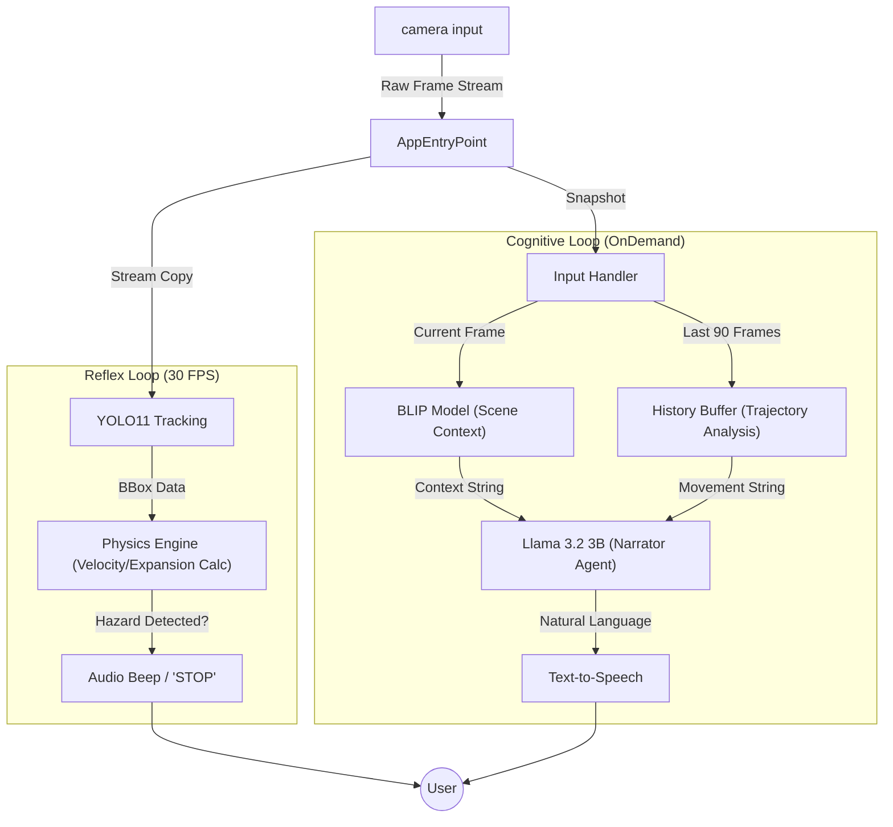

# Describe My Environment: Project Master Plan (v2.0)

**Course:** STATS 507  
**Focus:** Full-Stack ML Engineering / Edge Computing  
**Target Hardware:** Apple Silicon (M4 Pro) with camera input support (webcam or iPhone Continuity Camera)

🌐 **Project Website:** [https://stats-507-assignment.vercel.app/](https://stats-507-assignment.vercel.app/)

---

## 1. Core Mission

To build a **wearable-simulated AI assistant** for visually impaired users that creates a comprehensive understanding of the physical world. Unlike traditional tools that simply list objects ("Person, Chair"), this system provides **spatial and temporal context** ("A person is walking towards you from the left").

### The "Dual-Loop" Philosophy

The human brain processes vision in two modes: **Reflexes** (fast, survival-based) and **Cognition** (slow, detail-based). This project mimics that biology:

1.  **The Reflex Loop (Safety):** Runs at 30 FPS. Instantly warns of physical collision risks.
2.  **The Cognitive Loop (Narrator):** Runs On-Demand. Synthesizes history and vision into natural language stories.

---

## 2. Architectural Blueprint

### High-Level Data Flow



---

## 3. The Tech Stack (v2.0)

The stack leverages the M4 Pro's neural engine and the iPhone's advanced optics.

| Component         | Technology             | Role               | Reason for Choice                                                              |
| :---------------- | :--------------------- | :----------------- | :----------------------------------------------------------------------------- |
| **Input**         | **iPhone 17 Pro**      | Vision Sensor      | The **48MP Ultra-Wide (0.5x)** lens eliminates blind spots crucial for safety. |
| **Tracking**      | **YOLO11n-track**      | Object Persistence | Tracks unique IDs to calculate trajectory (Velocity & Direction).              |
| **Vision**        | **BLIP**               | Scene Captioning   | Provides the "Gist" of the scene (e.g., "A messy bedroom").                    |
| **Reasoning**     | **Llama 3.2 (3B)**     | Data Fusion        | Converts raw JSON data into human-like, helpful narration.                     |
| **Inference**     | **Ollama (Metal)**     | LLM Runner         | Optimized for Mac M4 GPU/NPU; runs locally with zero latency penalty.          |
| **Orchestration** | **Python (Threading)** | Controller         | Manages the async relationship between the fast and slow loops.                |

---

## 4. Project Structure

```
final/
├── README.md                 # This file
├── DEPLOYMENT.md             # Deployment guide (Local + Vercel)
├── requirements.txt          # Root Python dependencies
├── demo.ipynb                # Jupyter Notebook Demo (Core Pipeline)
├── run.py                    # Legacy CLI entry point
├── yolo11n.pt                # YOLO model weights
│
├── backend/                  # FastAPI Backend
│   ├── app/
│   │   ├── api/              # API Routes & Models
│   │   ├── core/             # Core Logic
│   │   ├── middleware/       # CORS & Middleware
│   │   └── main.py           # App Entry Point
│   ├── tests/                # Backend Tests
│   ├── requirements.txt
│   └── README.md
│
├── frontend/                 # Next.js Frontend
│   ├── app/                  # Next.js App Router Pages
│   ├── components/           # React Components
│   ├── hooks/                # Custom React Hooks
│   ├── lib/                  # Utilities & Types
│   ├── public/               # Static Assets
│   └── README.md
│
├── src/                      # Core ML codebase (Shared Logic)
│   ├── main.py               # Dual-loop system orchestrator
│   ├── config.py             # Configuration constants
│   ├── hardware/             # Camera & audio handlers
│   ├── reflex_loop/          # Safety monitoring (30 FPS)
│   ├── cognitive_loop/       # Scene narration (on-demand)
│   └── utils/                # Data structures & threading
│
├── report/                   # Final Report
│   └── README.md             # Report placeholder/link
│
├── docs/                     # Documentation
│   ├── README.md             # Documentation index
│   ├── USAGE.md              # Detailed usage guide
│   ├── CONTROL_FLOW.md       # System architecture diagrams
│   ├── logging.md            # Logging strategy
│   ├── WEB_APP_PLAN.md       # Web app architecture plan
│   ├── CHALLENGES_AND_LIMITATIONS.md
│   ├── WEARABLE_ARCHITECTURE.md
│   └── future_expansion_plan.md
│
├── scripts/                  # Utility scripts
│   ├── verify_ollama.py
│   ├── verify_tts.py
│   └── list_cameras.py
│
├── tests/                    # Core System Unit Tests
│   ├── test_physics.py
│   ├── test_safety.py
│   └── test_trajectory.py
│
└── test_images/              # Test image dataset
```

---

## 5. Quick Start

### 1. Installation

```bash
# Clone repository
git clone https://github.com/sorryshady/stats-507-assignment.git
cd final

# Create virtual environment
python -m venv venv
source venv/bin/activate  # On Windows: venv\Scripts\activate

# Install dependencies
pip install -r requirements.txt

# Verify Ollama setup (required for Narration)
python scripts/verify_ollama.py
```

### 2. Run the Jupyter Demo

This demonstrates the core ML pipeline without web servers.

```bash
jupyter notebook demo.ipynb
```

### 3. Run the Full Web Application

**Backend:**

```bash
cd backend
pip install -r requirements.txt
uvicorn app.main:app --reload --port 8000
```

**Frontend:**

```bash
# In a new terminal
cd frontend
npm install
npm run dev
```

Open [http://localhost:3000](http://localhost:3000)

### 4. Run the CLI Application (Legacy)

```bash
python run.py
```

---

## 6. Live Demo & Project Website

🌐 **Deployed Website:** [https://stats-507-assignment.vercel.app/](https://stats-507-assignment.vercel.app/)

The deployed website showcases:

- Project overview and architecture
- Demo videos demonstrating the system's capabilities
- Technical documentation and features
- About page with project details

**Note:** The deployed website displays demo videos and project information. For **interactive functionality** (real-time camera feed, object detection, and narration), you need to **clone the repository and run it locally** following the [Quick Start](#5-quick-start) guide above.

---

## 7. Documentation

- **[Usage Guide](docs/USAGE.md)** - Detailed running instructions
- **[System Architecture](docs/CONTROL_FLOW.md)** - Detailed control flow
- **[Web App Plan](docs/WEB_APP_PLAN.md)** - Full-stack architecture

---

## 8. Current Status

**Status:** Completed (Dec 3, 2025)

- Core ML pipeline (YOLO, BLIP, Llama 3.2)
- CLI application with dual-loop system
- Backend API (FastAPI)
- Frontend (Next.js)
- Jupyter notebook demo
- Final Report (in `report/`)
